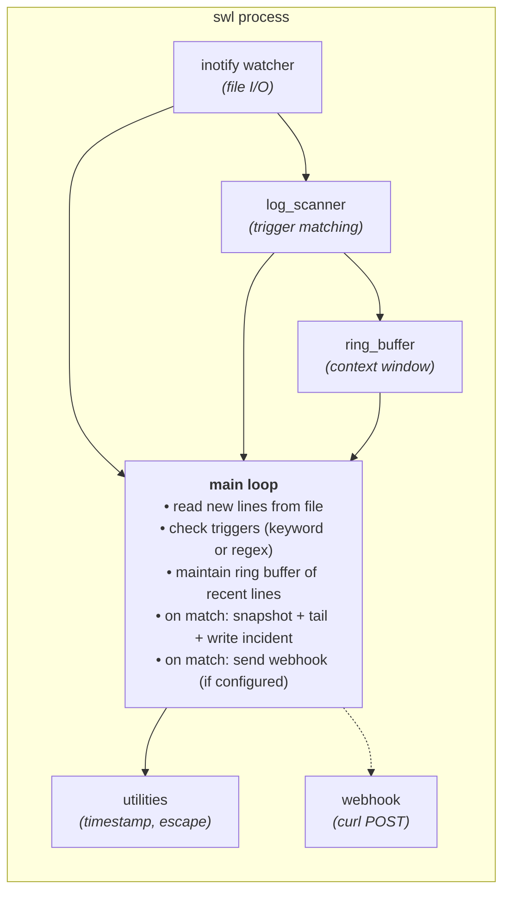

# swl Architecture

## Overview

swl is a real-time log anomaly detection tool written in C++17. It watches log files using Linux inotify, matches lines against configurable triggers (keywords or regex), and captures surrounding context for debugging.

## System Architecture



## Core Components

### 1. InotifyWatcher (`src/inotify_watcher.cpp`)
- Uses Linux inotify to watch log files for changes
- Handles file rotation (mv and truncate) via directory watch
- Thread-safe shutdown via `std::atomic<bool>`
- Returns file descriptor for poll-based event loop

### 2. LogScanner (`src/log_scanner.cpp`)
- Matches lines against trigger patterns
- Supports both keyword matching and POSIX regex
- PCRE shorthands (`\s`, `\d`, `\w`) converted to POSIX equivalents
- Exclusion patterns to skip false positives

### 3. RingBuffer (`src/ring_buffer.cpp`)
- Fixed-size circular buffer for context window
- O(1) push, O(n) snapshot
- Stores last N lines before trigger

### 4. WebhookAlert (`src/webhook_alert.cpp`)
- CURL-based HTTP POST for alerts
- Retry queue with configurable attempts and delay
- JSON payload with incident context
- SSL verification toggle

### 5. Config (`src/config.cpp`)
- CLI argument parsing
- Config file parsing (INI-style)
- Auto-discovery of log files
- Config file search: `./.swl.conf` → `~/.config/swl/config` → `/etc/swl/config`

### 6. Utilities (`src/utilities.cpp`)
- Timestamp formatting
- JSON string escaping
- Incident file writing
- Privilege dropping (`setuid`/`setgid`)

### 7. Subcommands (`src/subcommands.cpp`)
- `cmd_init`: Generate config file
- `cmd_status`: Print config and runtime info
- `cmd_incidents`: List recent incidents
- `cmd_logs`: Follow latest incident file
- `cmd_stop`: Stop running instance
- `cmd_clean`: Stop and remove files

### 8. Main (`src/main.cpp`)
- Entry point and signal handling
- Main monitoring loop
- Coordinate all components

## Data Flow

1. **File Change** → inotify notifies watcher
2. **Read Lines** → read from file offset
3. **Scan Lines** → check each line against triggers
4. **Buffer Lines** → push to ring buffer (always)
5. **On Match**:
   - Snapshot ring buffer (pre-context)
   - Read trailing lines (post-context)
   - Write incident file
   - Send webhook (if configured)
6. **Repeat** → poll for more changes

## File Layout

```
swl/
├── src/
│   ├── main.cpp              # Entry point, signal handling
│   ├── config.cpp            # CLI/config parsing
│   ├── utilities.cpp         # Shared helpers
│   ├── subcommands.cpp       # Subcommand implementations
│   ├── status_dashboard.cpp  # Status command
│   ├── inotify_watcher.cpp   # File watcher
│   ├── log_scanner.cpp       # Trigger matching
│   ├── ring_buffer.cpp       # Context buffer
│   └── webhook_alert.cpp     # Webhook delivery
├── include/
│   ├── config.h
│   ├── utilities.h
│   ├── subcommands.h
│   ├── status_dashboard.h
│   ├── inotify_watcher.h
│   ├── log_scanner.h
│   ├── ring_buffer.h
│   └── webhook_alert.h
├── tests/                    
├── config/                   # Sample config files
├── init/                     # Systemd unit files
├── benchmark.sh              # Performance benchmark
└── CMakeLists.txt            # Build system
```

## Build System

- **Primary**: cmake 3.14+
- **Fallback**: g++ with manual compilation
- **Dependencies**: libcurl, pthreads
- **Standard**: C++17

## Testing

- 6 test suites: ring_buffer, log_scanner, webhook, inotify, config, utilities
- No external test framework
- Raw `assert()` + `std::cout`
- Run with `ctest --test-dir build --output-on-failure`

## Performance Characteristics

- Binary size: ~111KB
- Startup: ~2ms
- Throughput: ~1.4M lines/sec (plain), ~1.3M lines/sec (regex)
- Memory: ~9MB idle, ~10MB under load
- FDs: 7 (no leaks)

## Signal Handling

- SIGINT/SIGTERM: graceful shutdown, drain buffer
- SIGUSR1: status dump (if implemented)
- Handlers use `_exit()` (async-signal-safe)

## Thread Safety

- `std::atomic<bool>` for shared flags
- `localtime_r()` for thread-safe time
- `O_CLOEXEC` on all file descriptors
