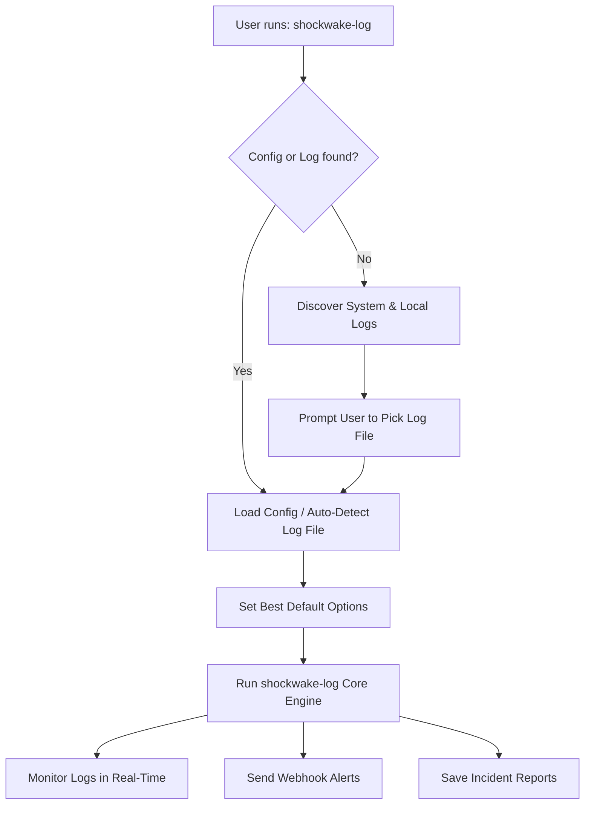

# SHOCKWAKE-LOG

High-performance real-time log anomaly detection with contextual debugging.

## Overview

`shockwake-log` monitors application logs and instantly captures the full context when failures occur. Instead of just finding an error line, it records exactly what happened before and after the incident — with near-zero CPU and memory overhead.

**Key Features:**
- Kernel-level file monitoring via inotify (no polling, no CPU waste)
- Sliding context window (configurable pre/post trigger lines)
- Regex pattern matching for triggers and exclusions
- Webhook alerts with automatic retry and failure queue (Discord, Slack, custom endpoints)
- Rate limiting with per-trigger cooldown to prevent alert storms
- Incident reports with full context snapshots
- Optional webhook — run with local-only incident logging
- Config file auto-loading from standard locations
- Auto-discovery of log files
- Privilege dropping after opening log files
- Graceful shutdown with clean inotify cleanup (SIGTERM/SIGINT)
- Built-in subcommands for easy management

## How It Works



## Requirements

- C++17 compiler (GCC 7+ / Clang 5+)
- libcurl development files
- Linux (uses inotify)

## Building

```bash
# Clone repository
git clone https://github.com/yourusername/shockwake-log.git
cd shockwake-log

# Build with CMake (if available)
mkdir build && cd build
cmake ..
make

# Or build directly with g++
g++ -std=c++17 -O2 src/*.cpp -Iinclude -lcurl -lpthread -o shockwake-log
```

## Quick Start

```bash
# One command — auto-discovers logs and runs with sensible defaults
shockwake-log

# Monitor a specific file
shockwake-log /var/log/syslog

# Generate a config file
shockwake-log init

# Check current configuration
shockwake-log status
```

No flags needed for basic usage. The tool auto-discovers log files and uses sensible defaults.

## Usage

```bash
# Auto-discover and monitor with defaults
shockwake-log

# Monitor a specific log file
shockwake-log /var/log/app.log

# With webhook alerts
shockwake-log --webhook https://hooks.slack.com/services/... /var/log/app.log

# Regex triggers with exclusions
shockwake-log \
  --triggers "OOM|killed|50[0-9]" \
  --exclude "healthcheck,DEBUG" \
  --window 200 \
  --trailing 30 \
  /var/log/app.log

# With rate limiting and retry
shockwake-log \
  --webhook https://hooks.slack.com/services/... \
  --triggers ERROR,FATAL \
  --cooldown 120 \
  --retries 5 \
  --retry-delay 2000 \
  /var/log/app.log

# Use a config file
shockwake-log --config /etc/shockwake-log/config
```

## Subcommands

| Command | Description |
|---------|-------------|
| `shockwake-log` | Monitor logs (auto-discover if no file specified) |
| `shockwake-log init` | Generate config file in current directory |
| `shockwake-log status` | Print current configuration and exit |
| `shockwake-log incidents` | List recent incident reports |
| `shockwake-log logs` | Follow the latest incident file |
| `shockwake-log stop` | Stop a running instance |
| `shockwake-log clean` | Stop and remove all generated files |

## Options

| Option | Description | Default |
|--------|-------------|---------|
| `--log <path>` | Log file to monitor | *auto-discovered* |
| `--webhook <url>` | Webhook URL for alerts (omit for local-only logging) | *none* |
| `--config <file>` | Config file path | *auto-loaded* |
| `--triggers <k1,k2>` | Comma-separated keywords or regex patterns | `FATAL,ERROR` |
| `--exclude <e1,e2>` | Exclusion patterns — lines matching these are skipped | *none* |
| `--window <n>` | Lines to keep in context buffer | `100` |
| `--trailing <n>` | Lines to capture after trigger | `20` |
| `--incidents <dir>` | Directory for incident reports | `./incidents` |
| `--cooldown <sec>` | Min seconds between alerts for same trigger (0 = no limit) | `60` |
| `--retries <n>` | Max webhook retry attempts on failure (0 = no retry) | `3` |
| `--retry-delay <ms>` | Delay between retries in milliseconds | `1000` |
| `--user <user>` | Drop to this user after opening log (requires root) | *none* |
| `--pid-file <path>` | PID file for stop/clean commands | *auto-detected* |
| `--help, -h` | Show help | — |

## Config File

Auto-loaded from (first found wins):
1. `./.shockwake-log.conf`
2. `./shockwake-log.conf`
3. `~/.config/shockwake-log/config`
4. `/etc/shockwake-log/config`

Create one with:
```bash
shockwake-log init
```

Config file format (key=value):
```ini
log = /var/log/app.log
webhook = https://hooks.slack.com/services/xxx
triggers = FATAL,ERROR,WARN
excludes = DEBUG,healthcheck,ping
window = 100
trailing = 20
incidents = /var/log/shockwake-incidents
cooldown = 60
retries = 3
retry_delay = 1000
user = syslog
```

CLI flags override config file values. Config file values override built-in defaults.

## Auto-Discovery

When `--log` is not provided, the tool searches for log files in this order:

1. **Current directory:** `*.log`, `logs/*.log`, `log/*.log`
2. **System logs:** `/var/log/syslog`, `/var/log/messages`, `/var/log/kern.log`, `/var/log/auth.log`, `/var/log/nginx/error.log`, `/var/log/docker.log`

Local logs (in the current directory) take priority over system logs.

## Incident Reports

When a trigger is detected, an incident report is generated:

```
=== SHOCKWAKE-LOG INCIDENT REPORT ===
Timestamp: 20260715_213415
Trigger: FATAL
Log File: /var/log/app.log
=====================================

--- PRE-TRIGGER CONTEXT ---
2026-07-15 10:23:45 INFO: User logged in
2026-07-15 10:23:46 DEBUG: Processing request
...

--- TRIGGER LINE ---
>>> FATAL DETECTED <<<

--- POST-TRIGGER CONTEXT ---
2026-07-15 10:23:47 ERROR: Connection lost
...
```

## Webhook Format

Alerts are sent as JSON payloads:

```json
{
  "content": "SHOCKWAKE-LOG ALERT\nTrigger: FATAL\nLog: /var/log/app.log\nIncident: ./incidents/incident_20260715.log"
}
```

Failed webhook attempts are automatically retried up to `--retries` times with `--retry-delay` milliseconds between attempts. Dropped alerts (after all retries exhausted) are reported on shutdown.

## Rate Limiting

The `--cooldown` flag prevents alert storms during cascading failures. When a trigger fires, the same trigger is suppressed for `--cooldown` seconds:

```bash
# At most one ERROR alert every 60 seconds
shockwake-log --triggers ERROR --cooldown 60 /var/log/app.log

# No cooldown (every trigger fires immediately)
shockwake-log --triggers ERROR --cooldown 0 /var/log/app.log
```

Suppressed alert counts are printed on shutdown.

## License

MIT License. See [LICENSE](LICENSE) for details.
