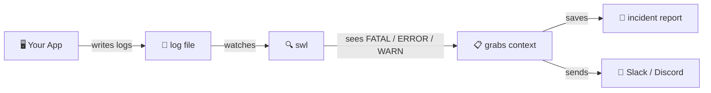

<h1 align="center">swl</h1>
<h3 align="center">Real-time log anomaly detection</h3>
<p align="center">Catches failures in context, not just the error line.</p>



**swl** watches your log files 24/7. When something goes wrong, it doesn't just tell you *what* failed — it saves *everything around it* so you can see **why** it failed.

---

## Install

```bash
git clone https://github.com/sahils0/shockwake-log.git
cd shockwake-log
g++ -std=c++17 -O2 src/*.cpp -Iinclude -lcurl -lpthread -o swl
sudo mv swl /usr/local/bin/
```

**Requirements:** Linux, g++ 7+, libcurl-dev (`sudo apt install libcurl4-openssl-dev`)

## Quick Start

```bash
# auto-discover and monitor logs
swl

# monitor a specific file
swl /var/log/syslog

# generate a config file and edit it
swl init
```

No flags needed. It just works.

## Usage

```bash
swl                                  # auto-discover logs, sensible defaults
swl /var/log/app.log                 # monitor specific file
swl --webhook URL /var/log/app.log   # with webhook alerts
swl --config /etc/swl/config         # use config file
```

## Config

```bash
swl init    # creates .swl.conf in current directory
```

```ini
log = /var/log/app.log
webhook = https://hooks.slack.com/services/xxx
triggers = FATAL,ERROR,WARN
excludes = DEBUG,healthcheck
window = 100
trailing = 20
cooldown = 60
```

Auto-loaded from (first found wins):
`./.swl.conf` → `~/.config/swl/config` → `/etc/swl/config`

## Subcommands

| Command | What it does |
|---------|--------------|
| `swl` | Monitor logs |
| `swl init` | Generate config file |
| `swl status` | Live dashboard (uptime, incidents, config) |
| `swl incidents` | List recent incident reports |
| `swl logs` | Follow latest incident file |
| `swl stop` | Stop running instance |
| `swl clean` | Stop and remove generated files |

## Options

| Flag | Description | Default |
|------|-------------|---------|
| `--log <path>` | Log file to monitor | auto-discovered |
| `--webhook <url>` | Webhook URL for alerts | none (local only) |
| `--config <file>` | Config file path | auto-loaded |
| `--triggers <k1,k2>` | Keywords or regex patterns | `FATAL,ERROR` |
| `--exclude <e1,e2>` | Skip lines matching these | none |
| `--window <n>` | Context lines before trigger | `100` |
| `--trailing <n>` | Lines after trigger | `20` |
| `--cooldown <sec>` | Min seconds between same-alert | `60` |
| `--retries <n>` | Webhook retry attempts | `3` |
| `--retry-delay <ms>` | Delay between retries | `1000` |
| `--no-ssl-verify` | Disable SSL cert verification | disabled |
| `--max-line-length <n>` | Max chars per log line | `8192` |
| `--user <user>` | Drop privileges after opening log | none |
| `--help` | Show help | — |

## License

MIT
